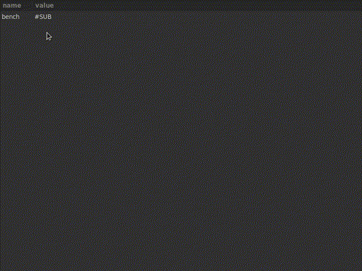

Netidx is like DNS for values. With netidx you can name individual
values in your program, and other programs can find and subscribe to
those values securely over the network.

Like DNS netidx maintains a hierarchical namespace in a resolver
server. Publishers tell the resolver about values they
have. Subscribers ask the resolver for values they want. Once a
subscriber knows where to find a value it is looking for, it
connects directly to the publisher, and the resolver is no longer
involved.

 # Publisher
 ```rust
 use netidx::{
    publisher::{Publisher, Value, BindCfg},
    config::Config,
    resolver::Auth,
    path::Path,
};
use tokio::time;
use std::time::Duration;

// load the site cluster config. You can also just use a file.
let cfg = Config::load_default()?;

// no authentication (kerberos v5 is the other option)
// listen on any unique address matching 192.168.0.0/16
let publisher = Publisher::new(cfg, Auth::Anonymous, "192.168.0.0/16".parse()?).await?;

let temp = publisher.publish(
    Path::from("/hw/washu-chan/cpu-temp"),
    Value::F32(get_cpu_temp())
)?;
publisher.flush(None).await?;

loop {
    time::delay_for(Duration::from_millis(500)).await;
    temp.update(Value::F32(get_cpu_temp()));
    publisher.flush(None).await?;
}
```

 # Subscriber
 ```rust
 use netidx::{
    subscriber::Subscriber,
    config::Config,
    resolver::Auth,
    path::Path,
};
use futures::{prelude::*, channel::mpsc};

let cfg = Config::load_default()?;
let subscriber = Subscriber::new(cfg, Auth::Anonymous)?;
let path = Path::from("/hw/washu-chan/cpu-temp");
let temp = subscriber.subscribe_one(path, None).await?;
println!("washu-chan cpu temp is: {:?}", temp.last());

let (tx, mut rx) = mpsc::channel(10);
temp.updates(false, tx);
while let Some(mut batch) = rx.next().await {
    for (_, v) in batch.drain(..) {
        println!("washu-chan cpu temp is: {:?}", v);
    }
}
```

Published values always have a value, and new subscribers receive
the most recent published value initially. Thereafter a
subscription is a lossless ordered stream, just like a tcp
connection, except that instead of bytes Values are the unit of
transmission. Since the subscriber can write values back to the
publisher, the connection is bidirectional, also like a Tcp
stream.

Values include many useful primitives, including zero copy bytes
buffers (using the awesome bytes crate), so you can easily use
netidx to efficiently send any kind of message you like. However
it's advised to stick to primitives and express structure with
muliple published values in a hierarchy, since this makes your
system more discoverable, and is also quite efficient.

# Browser

In the case where you publish values in a regular structure you can
use netidx browser to visualize part of your tree as a table.



A row in the table is made of a root node with a child for each column.
If a subtree consists of row nodes that share the same columns most of the time
then it can be drawn as a table in the browser. e.g.

```
/bench/0/0
/bench/0/1
/bench/0/2
```

is one row, the next row is

```
/bench/1/0
/bench/1/1
/bench/1/2
```

Since these two rows both have columns 0, 1, and 2, they would be drawn
by the browser as two rows 0, and 1, each with three columns 0, 1, and 2.

# Security

Many environments require strong security, whereas in others it may
not be necessary. To handle both of these cases netidx includes optional
support for kerberos v5 (a.k.a. ms active directory). If enabled,
all components will do mutual authentication between the resolver,
subscriber, and publisher as well as encryption of all data on the
wire. In addition to authentication, the resolver server in krb5
mode maintains and enforces authorization permissions for the
entire namespace, so whoever runs the resolvers can centrally
enforce who can publish where, and who can subscribe to what.
